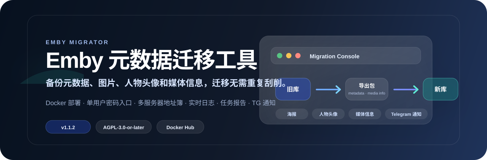
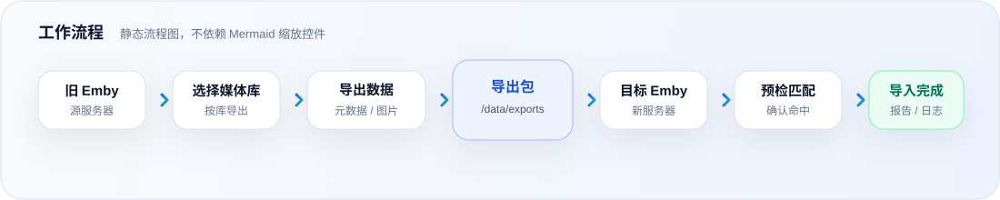

<p align="center">
  <a href="README.md">中文</a> · English
</p>

[](https://github.com/czppw/emby-migrator)
[](https://hub.docker.com/r/czppwa/emby-migrator)
[](https://github.com/czppw/emby-migrator/releases/latest)


# Emby Migrator

> **Moving to a new Emby server and do not want to re-scrape your entire library?**
>
> Emby Migrator is a lightweight Docker Web tool for migrating and backing up Emby metadata, artwork, people images, and compatible media information.

Use it when you need to:

- move to a new server or rebuild an Emby library;
- avoid re-scraping a large media collection;
- migrate media information between Emby instances;
- back up metadata, artwork, and people images on a regular basis.



## What problem does it solve?

After an Emby migration, the files may be available again, but titles, descriptions, cast, artwork, people images, and media information usually need to be matched and downloaded again. That takes time and can produce different results because of network failures, naming differences, or scraper changes.

Emby Migrator separates the process into two stages:

```text
Old Emby
  │ Export metadata, artwork, people images, and media information
  ▼
Portable, inspectable migration package
  │
  ▼
Scan files on the new Emby to create media items
  │ Do not re-scrape
  ▼
Import and match using stable media identifiers
  │
  ▼
Restore metadata, artwork, people images, and compatible media information
```

**Important: scanning is not scraping.** The new Emby still needs to scan the files so that media items exist. Emby Migrator primarily helps you avoid re-scraping and downloading information that you already have.

## Core capabilities

| Capability | Description |
| --- | --- |
| Metadata migration | Export and import titles, descriptions, cast, ratings, and related metadata |
| Artwork migration | Posters, backdrops, logos, banners, art, thumbnails, disc images, and more |
| People migration | Export and import people records and actor images |
| Media information | Optionally migrate codecs, resolution, bitrate, audio, subtitles, and chapters |
| Stable matching | Prefer filenames, ProviderIds, and episode information instead of old Item IDs |
| Import preview | Review matched, unmatched, ambiguous, and error items before writing |
| Import reports | Keep task logs, match results, image statistics, and failure summaries |
| Incremental export | Process new or changed content without repeating the entire export |
| Web interface | Manage servers, packages, jobs, and logs from a browser |
| Telegram notifications | Send test messages and final task notifications |
| Docker deployment | Run as a single container with independently mounted data and configuration |

## Compatibility matrix

| Feature | Emby 4.8.11 → 4.8.11 | Emby 4.9.5 → 4.9.5 | 4.8 ↔ 4.9 |
| --- | :---: | :---: | :---: |
| Metadata | ✅ | ✅ | ✅ |
| Artwork | ✅ | ✅ | ✅ |
| People and actor images | ✅ | ✅ | ✅ |
| MediaInfo | ✅ | ✅ | ❌ |
| MediaStreams | ✅ | ✅ | ❌ |
| Chapters | ✅ | ✅ | ❌ |

Regular metadata, artwork, and people information use the Emby API and can be migrated across versions. Media information requires a stopped target Emby and a version-specific write to `library.db`. Cross-version media database writes are explicitly rejected.

## Recommended migration workflow

### On the old server

1. Connect the old Emby server in Emby Migrator.
2. Select the libraries to migrate.
3. Export metadata, artwork, and people images.
4. If required, include MediaInfo, MediaStreams, and Chapters.
5. Copy the complete migration package to the new server.

### On the new server

1. Install a compatible Emby version.
2. Create libraries pointing to the media files.
3. Disable automatic identification, image downloading, and real-time metadata updates.
4. **Scan files only so Emby creates the media items.**
5. Run the Emby Migrator import preview.
6. Review the match results and start the import.
7. Verify representative items before enabling later automatic jobs.

### Restoring media information

Media information restoration is an optional two-stage workflow:

1. The online stage reads the target items and creates an immutable match plan.
2. The target Emby is stopped, `library.db` is backed up, target identity and version are checked, and the database is updated.
3. Emby is started again and the result is verified through the API.

Do not write to `library.db` when the target version or database identity is unknown.

## Quick deployment

### Minimal deployment

```bash
mkdir -p /opt/emby-migrator/data/imports \
         /opt/emby-migrator/config \
         /opt/emby-migrator/imports

docker run -d \
  --name emby-migrator \
  --restart unless-stopped \
  --network host \
  -e TZ=Asia/Shanghai \
  -e EMBY_MIGRATOR_PASSWORD='choose-a-strong-password' \
  -e EMBY_MIGRATOR_IMPORT_ROOT=/imports \
  -v /opt/emby-migrator/data:/data \
  -v /opt/emby-migrator/config:/config \
  -v /opt/emby-migrator/imports:/imports \
  czppwa/emby-migrator:v1.1.6
```

Open:

```text
http://your-server-ip:8787
```

Export packages are stored at:

```text
/opt/emby-migrator/data/exports
```

Import packages are read from:

```text
/opt/emby-migrator/data/imports
```

### Additional mounts for media information

To restore MediaInfo, MediaStreams, or Chapters, mount the target Emby config directory read/write and allow the tool to manage the target container:

```bash
-e EMBY_MIGRATOR_EMBY_DB_ROOT=/emby-dbs \
-e EMBY_MIGRATOR_DOCKER_HOST=unix:///var/run/docker.sock \
-v /opt/emby/config:/emby-dbs/default \
-v /var/run/docker.sock:/var/run/docker.sock
```

The UI discovers the target `library.db`. When automatic stop/start is enabled, the application validates the target ServerID, version family, database schema, and project anchors before creating a backup and writing the database.

> `/var/run/docker.sock` grants host-level Docker management access. Enable it only in a trusted single-user environment. It is not required for ordinary metadata, artwork, and people migration.

## Web UI workflow

1. Sign in to the Web UI.
2. Add the source and target Emby URLs and API keys.
3. Test and save the server profiles.
4. Select source libraries and export options.
5. Start the export and wait for the package.
6. Copy the complete package to `data/imports` or the separate `imports` directory on the new server.
7. Refresh the package list and run the import preview.
8. Review the match results and start the import.
9. Download the report and inspect successful, unmatched, ambiguous, and failed items.

## Security notes

- Do not use a default password on a public deployment.
- API keys are stored by the backend; configuration APIs do not return cleartext keys to the frontend.
- Logs avoid printing complete API keys where possible.
- Media information is written only after an explicit user action and when the target Emby is stopped.
- A SQLite backup is created before writes, followed by transactional integrity checks.
- Database paths are restricted to `EMBY_MIGRATOR_EMBY_DB_ROOT`.
- Set `EMBY_MIGRATOR_SESSION_SECRET` to keep the login cookie signing key stable across restarts.

## Docker Compose

```yaml
services:
  emby-migrator:
    image: czppwa/emby-migrator:v1.1.6
    container_name: emby-migrator
    network_mode: host
    environment:
      TZ: Asia/Shanghai
      EMBY_MIGRATOR_PASSWORD: choose-a-strong-password
      EMBY_MIGRATOR_IMPORT_ROOT: /imports
    volumes:
      - /opt/emby-migrator/data:/data
      - /opt/emby-migrator/config:/config
      - /opt/emby-migrator/imports:/imports
    restart: unless-stopped
```

## Local development

```bash
go test ./...
go vet ./...
go run ./cmd/server
```

Open:

```text
http://localhost:8787
```

Health check:

```bash
curl http://localhost:8787/api/health
```

## Project boundaries

Emby Migrator is an on-demand migration and backup/restore tool, not a permanent bidirectional synchronizer. It does not migrate:

- playback progress;
- favorites;
- collection relationships;
- global Emby settings;
- media items that have not yet been scanned into the new Emby.

## Links

- GitHub: <https://github.com/czppw/emby-migrator>
- Docker Hub: <https://hub.docker.com/r/czppwa/emby-migrator>
- Current version: `v1.1.6`
- License: AGPL-3.0-or-later

## License

Emby Migrator is licensed under the **GNU Affero General Public License v3.0 or later**. Forks, modified versions, redistributions, and network deployments should retain the original copyright notice, NOTICE, project source link, and AGPL license terms.
