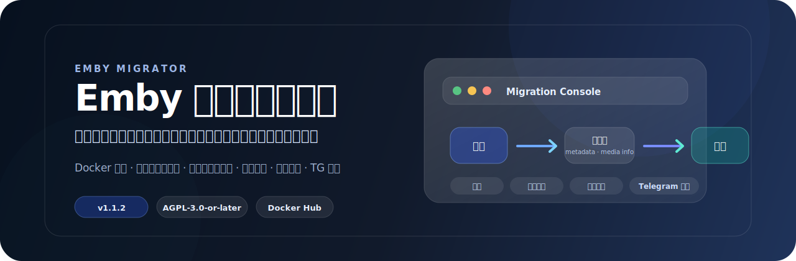
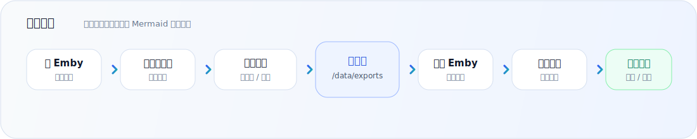

[](https://github.com/czppw/emby-migrator)
[](https://hub.docker.com/r/czppwa/emby-migrator)


# Emby Migrator

**Emby Migrator** 是一个轻量级 Docker Web 工具，用于导出和导入 Emby 媒体库的元数据、海报图片、人物头像及媒体技术信息。

它适合在迁移设备、重建媒体库、换服务器或做元数据备份时使用，目标是尽量避免重新刮削带来的耗时、失败和匹配偏差。

> 官方仓库：<https://github.com/czppw/emby-migrator>
> 官方镜像：<https://hub.docker.com/r/czppwa/emby-migrator>
> 开源协议：`AGPL-3.0-or-later`

导出时保存 `manifest.json`、`info.json`、`raw.json` 和图片；导入时不使用旧 Emby 内部 ID 做跨服务器匹配，而是优先使用媒体文件名、ProviderIds、剧集信息、名称和 OriginalTitle。

---

## 项目特点

| 功能 | 说明 |
| --- | --- |
| 元数据导出 / 导入 | 保存 `manifest.json`、`info.json`、`raw.json` 等数据，并通过 Emby API 回写。 |
| 媒体技术信息 | 可选导出 `MediaSources`、`MediaStreams`、`Chapters`；在线匹配后停服写入 `library.db`，无需插件。 |
| 图片备份 | 支持主海报、背景图、Logo、缩略图、横幅图、艺术图、光盘图、盒装图、截图等类型。 |
| 人物头像 | 支持演员 / 人物头像导出和导入，减少迁移后头像缺失。 |
| 名称匹配 | 不依赖旧 Emby 内部 ID，优先按媒体文件名、ProviderIds、剧集信息、名称和 OriginalTitle 匹配。 |
| 多服务器地址簿 | 保存多个 Emby 地址和 API Key，导出服务器和导入服务器可以分别选择。 |
| 实时日志 | 网页端实时查看任务进度，完整日志可下载。 |
| 版本检查 | 后台缓存检查 GitHub 最新正式版，仅在有新版本时于顶部显示小提示。 |
| 导入报告 | 生成匹配、未匹配、歧义、错误、图片和头像统计报告。 |
| Telegram 通知 | 支持中文任务通知，可配置代理，代理只用于访问 Telegram。 |
| 单用户入口 | 提供简单密码登录入口，适合个人自托管。 |
| 内存控制 | 任务完成后减少内存日志和任务对象长期占用，完整文件仍保存在 `/data`。 |

---

## 适合场景

- 从旧 Emby 服务器迁移到新服务器。
- 重建媒体库，但不想重新刮削全部元数据和图片。
- 定期备份 Emby 元数据、海报和人物头像。
- 多个 Emby 实例之间迁移媒体库信息。
- 希望通过网页界面操作，而不是手动运行脚本。

---

## 工作流程



不同 Emby 实例的内部 ID 通常不同，所以项目不会把旧 Emby 的内部 ID 当作跨服务器匹配依据。导入时会根据导出包里的媒体信息，在目标 Emby 中重新搜索并匹配对应媒体。

---

## 快速部署

### 1. 创建宿主机目录

```bash
mkdir -p /opt/emby-migrator/data/imports /opt/emby-migrator/config /opt/emby-migrator/imports
```

### 2. 启动容器

```bash
docker run -d \
  --name emby-migrator \
  --restart unless-stopped \
  --network host \
  -e TZ=Asia/Shanghai \
  -e EMBY_MIGRATOR_PASSWORD=password \
  -e EMBY_MIGRATOR_IMPORT_ROOT=/imports \
  -v /opt/emby-migrator/data:/data \
  -v /opt/emby-migrator/config:/config \
  -v /opt/emby-migrator/imports:/imports \
  czppwa/emby-migrator:latest
```

普通元数据、图片和人物头像迁移只需要上面的挂载。若要恢复媒体技术信息，还需把**目标 Emby 的 config 目录以读写方式**挂入 `/emby-dbs`。例如目标 config 位于 `/opt/emby/config`：

```bash
-e EMBY_MIGRATOR_EMBY_DB_ROOT=/emby-dbs \
-e EMBY_MIGRATOR_DOCKER_HOST=unix:///var/run/docker.sock \
-v /opt/emby/config:/emby-dbs/default \
-v /var/run/docker.sock:/var/run/docker.sock
```

页面会自动扫描并选择 `default/data/library.db`。在服务器档案中填写目标 Emby 容器名并启用“自动停启容器”后，应用会自动完成停止 Emby、写库、重新启动和 API 回读验证。只支持 `4.8.11.x -> 4.8.11.x` 和 `4.9.5.x -> 4.9.5.x`，不支持跨版本媒体技术信息写入。

`/var/run/docker.sock` 等同于宿主机 Docker 管理权限，只应在可信的单用户环境启用。不挂载 Socket 时，数据库仍可自动发现，但需要手动停止和启动 Emby。

如果想固定正式版：

```bash
czppwa/emby-migrator:v1.1.1
```

### 3. 打开网页

```text
http://服务器IP:8787
```

默认登录密码：

```text
password
```

登录后建议第一时间修改密码。

---

## Docker Compose

```yaml
services:
  emby-migrator:
    image: czppwa/emby-migrator:latest
    container_name: emby-migrator
    network_mode: host
    environment:
      TZ: Asia/Shanghai
      EMBY_MIGRATOR_PASSWORD: password
      EMBY_MIGRATOR_IMPORT_ROOT: /imports
      EMBY_MIGRATOR_EMBY_DB_ROOT: /emby-dbs
      EMBY_MIGRATOR_DOCKER_HOST: unix:///var/run/docker.sock
    volumes:
      - /opt/emby-migrator/data:/data
      - /opt/emby-migrator/config:/config
      - /opt/emby-migrator/imports:/imports
      - /opt/emby/config:/emby-dbs/default
      - /var/run/docker.sock:/var/run/docker.sock
    restart: unless-stopped
```

---

## 默认路径

| 项目 | 路径 / 默认值 |
| --- | --- |
| Web 端口 | `8787` |
| 默认密码 | `password` |
| 容器数据目录 | `/data` |
| 容器配置目录 | `/config` |
| 本机迁移包目录 | `/data/imports` |
| 独立迁移包挂载目录 | `/imports` |
| Emby 数据库挂载根目录 | `/emby-dbs` |
| 容器导出包目录 | `/data/exports` |
| 宿主机导出包目录 | `/opt/emby-migrator/data/exports` |
| 应用配置 | `/config/settings.json` |
| Telegram 配置 | `/config/telegram.json` |
| 完整任务日志 | `/data/logs` |

如果宿主机 `8787` 端口已被占用，可以改端口：

```bash
-e EMBY_MIGRATOR_ADDR=:8788
```

---

## 页面使用方式

1. 登录 Web 页面。
2. 填写 Emby 地址和 API Key。
3. 点击 **测试连接**。
4. 点击 **保存服务器**，加入服务器地址簿。
5. 选择导出服务器和导入服务器。
6. 读取媒体库，选择需要导出的媒体库。
7. 启动导出任务，等待导出包生成。
8. 选择导出包，执行导入预检。
9. 确认匹配情况后执行导入。
10. 查看实时日志、导入报告和任务总结。
11. **阶段一（在线）**：需要恢复媒体技术信息时，保持目标 Emby 运行，确认在线导入已生成数据库计划。
12. 确认页面已自动识别数据库，填写并保存目标 Emby 容器名。
13. 启用自动停启后点击 **应用媒体信息计划**，程序会停止容器、写库、启动并回读验证。

从旧设备复制导出包时，请复制完整文件夹（必须包含 `manifest.json`）到宿主机：

```text
/opt/emby-migrator/data/imports/
```

容器内对应路径为 `/data/imports/包名`。点击“刷新导出包”后会自动出现在列表中。使用独立挂载目录时，将完整导出包文件夹放到 `/opt/emby-migrator/imports/`，程序会从容器内 `/imports` 自动扫描。

---

## Telegram 通知

页面支持保存 Telegram Bot Token、Chat ID 和可选代理地址。

- 支持中文测试消息。
- 支持任务完成、失败、停止等终态通知。
- 导出通知显示源服务器。
- 导入和预检通知显示源服务器与目标服务器。
- 代理只用于访问 Telegram，不影响 Emby 连接。

代理示例：

```text
http://127.0.0.1:7890
```

---

## 内存与日志保留

任务完成后，程序只在内存里保留任务摘要、最近日志和最近任务记录；完整导出包、导入报告和任务日志仍写在 `/data` 下。

可选环境变量：

```bash
-e EMBY_MIGRATOR_MAX_MEMORY_LOGS=2000 \
-e EMBY_MIGRATOR_MAX_COMPLETED_JOBS=20 \
-e EMBY_MIGRATOR_JOB_RETENTION_HOURS=24 \
-e EMBY_MIGRATOR_RELEASE_MEMORY_ON_FINISH=true
```

大媒体库长期运行时，可以把 `EMBY_MIGRATOR_MAX_MEMORY_LOGS` 调低到 `500` 或 `1000`。

---

## Host 网络说明

推荐使用 `--network host`。

这样容器内访问：

```text
127.0.0.1
```

就是宿主机本机，方便连接本机 Emby、代理或反向代理。host 模式下不需要 `-p` 端口映射。

如果 Emby 在另一台服务器，直接填写远程服务器地址即可，例如：

```text
http://192.168.1.10:8096
```

---

## 安全说明

- 默认密码是 `password`，公开部署后请立即修改。
- API Key 只通过页面请求发送给后端，不写入代码或镜像。
- 后端保存服务器 API Key，前端读取配置时只返回掩码，不回传明文 Key。
- 日志会尽量避免打印完整 API Key。
- 普通元数据、图片和人物头像通过 Emby API 写入；媒体技术信息只在用户明确操作、目标 Emby 已停止时写入挂载的 `library.db`。
- 写库前自动创建 SQLite 一致性备份，使用事务并执行 `integrity_check`；数据库路径被限制在 `EMBY_MIGRATOR_EMBY_DB_ROOT` 内。
- 可设置 `EMBY_MIGRATOR_SESSION_SECRET` 固定登录 Cookie 签名密钥；不设置时每次启动自动生成临时密钥。

---

## 当前能力状态

已验证能力：

- Emby `4.8.11` / `4.9.5` 基础导出、预检和实际导入。
- Emby `4.8` 与 `4.9` 之间的跨版本导入。
- 元数据、媒体图片和人物头像导出 / 导入。
- 媒体技术信息导出、同版本离线恢复和重启后 API 回读验证（`4.8.11.x`、`4.9.5.x`）。
- 普通元数据和图片仍可跨版本迁移；媒体技术信息跨版本会明确拒绝。
- 多服务器地址簿。
- Telegram 中文通知。
- 增量导出、导入增量包。
- 基于上次导入报告跳过已成功项目的基础续跑。

仍可继续增强：

- 更完整的失败分组和风险等级报告。
- 更细粒度的断点续跑状态。
- 导入后差异对比报告。

---

## 本地开发

```bash
go test ./...
go run ./cmd/server
```

打开：

```text
http://localhost:8787
```

健康检查：

```bash
curl http://localhost:8787/api/health
```

Windows 本地长期运行可以使用：

```powershell
powershell -ExecutionPolicy Bypass -File .local-run\start-server.ps1
powershell -ExecutionPolicy Bypass -File .local-run\stop-server.ps1
```

如果本地构建遇到 Git `dubious ownership` 或 buildvcs 问题，可以使用：

```powershell
go build -buildvcs=false -o server.exe ./cmd/server
```

---

## 开源协议与项目归属

Emby Migrator 使用 **GNU Affero General Public License v3.0 or later** 授权：

```text
AGPL-3.0-or-later
```

项目官方来源：

- GitHub：<https://github.com/czppw/emby-migrator>
- Docker Hub：<https://hub.docker.com/r/czppwa/emby-migrator>

Fork、修改版、重新分发副本和对外提供网络访问的部署版本，都必须保留：

- `LICENSE`
- `NOTICE`
- 原始版权声明
- 项目来源链接
- AGPL 授权条款

---

**Emby Migrator** 让 Emby 迁移、备份和重建媒体库更轻松。
